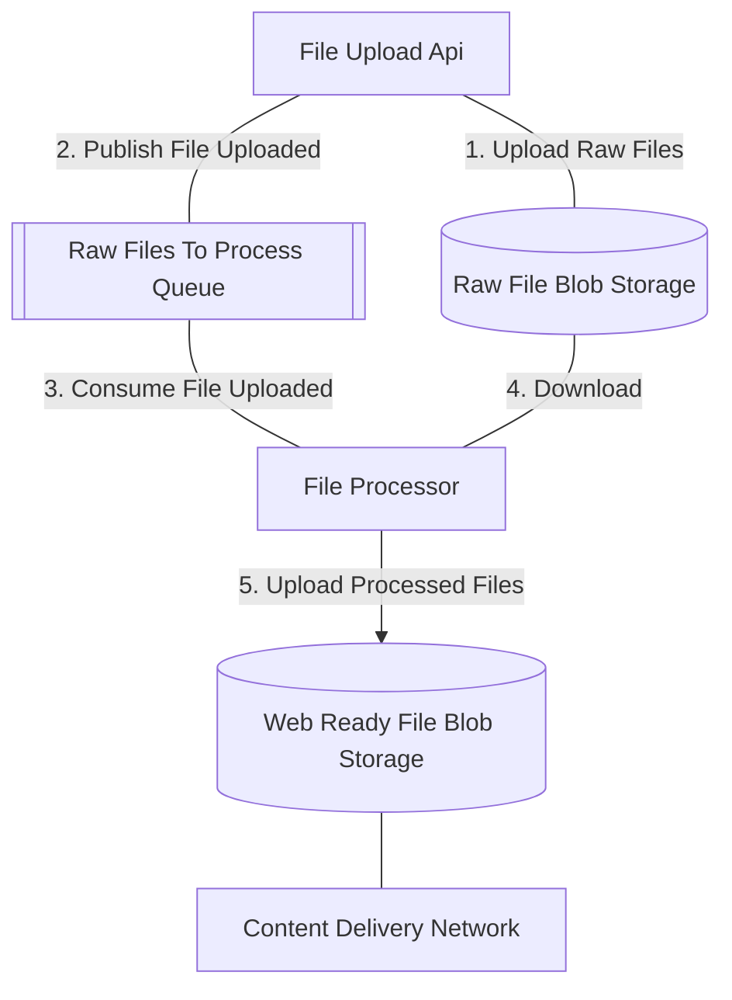

# WebifyVideo
Upload a video, and transcode / encode it using ffmpeg

```mermaid
graph TD;
    uploadApi[File Upload Api];
    fileProcessor[File Processor];
    
    rawStorageQueue[[Raw Files To Process Queue]];
    rawBlobStorage[(Raw File Blob Storage)];
    
    webReadyStorage[(Web Ready File Blob Storage)]
    cdn[Content Delivery Network]
        
    uploadApi-- 1. Upload Raw Files --- rawBlobStorage;
    uploadApi-- 2. Publish File Uploaded --- rawStorageQueue;    
    
    rawStorageQueue-- 3. Consume File Uploaded ---fileProcessor;
    rawBlobStorage-- 4. Download ---fileProcessor;
    
    fileProcessor-- 5. Upload Processed Files --> webReadyStorage;
    webReadyStorage --- cdn    
```
