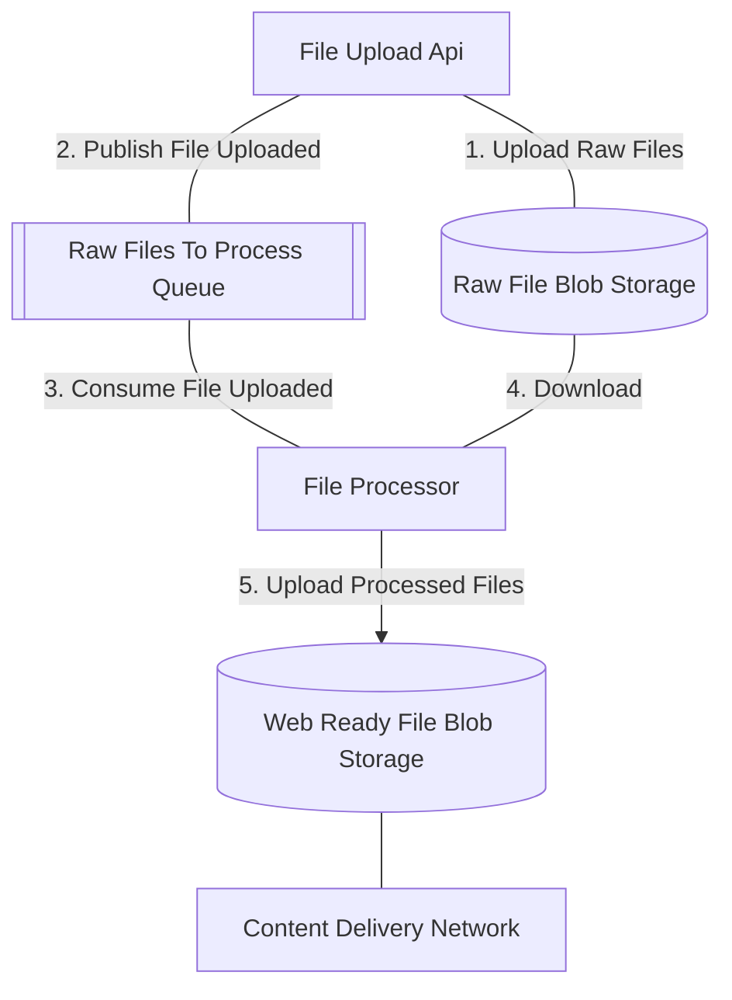

# WebifyVideo
Upload a video, and transcode / encode it using ffmpeg

# A few important technologies

## HLS (HTTP Live Streaming)
HLS (HTTP Live Streaming) is a streaming protocol developed by Apple for delivering live and on-demand video content over the internet. HLS is supported by a wide range of devices and platforms, including iOS devices, Apple TV, Android devices, web browsers, and more.

HLS supports a variety of video formats, including:

MPEG-2
H.264 (AVC)
H.265 (HEVC)
VP8
VP9
AV1
HLS also supports a range of audio codecs, including AAC, MP3, and AC-3. It's important to note that the specific video and audio codecs supported may vary depending on the device or platform. In general, it's recommended to use widely supported codecs such as H.264 and AAC to ensure the best compatibility across different devices and platforms.

## M3U8 File Format
M3U8 is a file format used for HLS (HTTP Live Streaming) playlists. An M3U8 file is essentially a playlist file that contains a list of URLs to media files, along with additional metadata describing how the media should be played back.

The M3U8 file is used by an HLS server to provide the client with the necessary information to access and play the media files. The playlist can contain multiple versions of the same media file at different bitrates and resolutions, allowing the client to choose the appropriate version based on the available network bandwidth and device capabilities.

M3U8 files are typically written in plain text using UTF-8 encoding, and can be opened and edited with a text editor. They may contain directives for media playback, such as specifying the media type, duration, and codec information.

M3U8 files are commonly used for streaming live and on-demand video content over the internet, and are widely supported by media players and streaming platforms.
